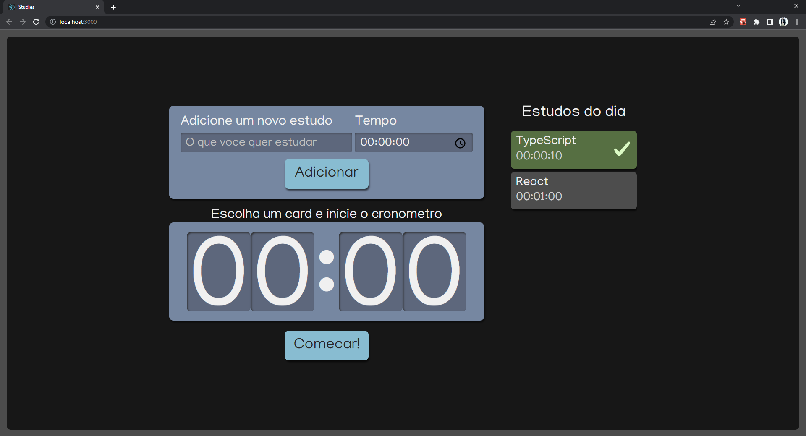

# Organizador de tarefas

Este projeto é um artefato do curso React: escrevendo com Typescript. O projeto tem como objetivo demonstrar os conceitos do react(class component, function component, , props, states...) por meio de um gerenciador de atividades web.

## Como utilizar

Para iniciar o projeto, deverá ser executado:

### `npm install`

### `npm start`

Inicia o app em modo desenvolvedor
Abra [http://localhost:3000](http://localhost:3000) para visualizar o projeto no navegador.

## Projeto

            

Foram implementados os seguintes componentes:

- Input para adicionar uma tarefa;
- Seletor de tempo para a tarefa;
- Cards selecionáveis de tarefas criadas;
- Cronômetro;
- Checklist ao fim da atividade;

### Referências

Curso React Alura: https://cursos.alura.com.br/course/react-modernizando-escrever-typescript
Documentação React: https://pt-br.reactjs.org

